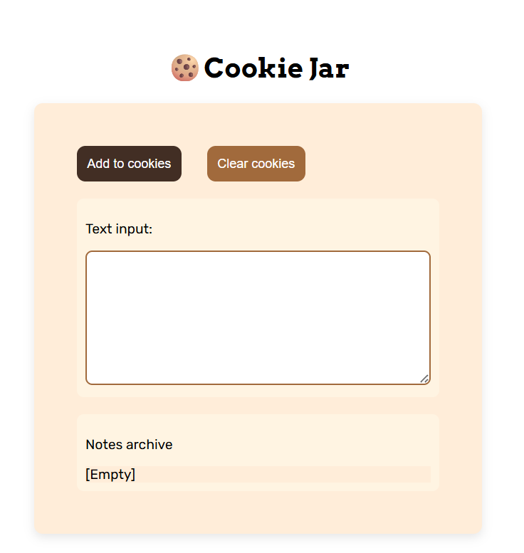

# 🍪 Cookie Jar

## Screenshot

A simple note-tracking web app that uses browser cookies to save your notes — even after refreshing the page.

## Features

- Add notes through a text input, saved to a single accumulating archive
- Notes persist across page refreshes using `document.cookie`, with a 30-day expiry
- Alerts the user if they try to submit an empty note
- Clear all saved notes with a confirmation prompt before deleting
- Displays `[Empty]` when no notes exist yet (first visit, or after cookie expiry)

## Technologies Used

- HTML
- CSS (Flexbox for layout, custom styling/theme)
- JavaScript (DOM manipulation, `document.cookie`, `Date` object, string methods)

## What I Learned

- How `document.cookie` works as a getter/setter, and why writing to it merges rather than overwrites
- Why raw newline characters can silently break cookie writes, and how `encodeURIComponent()` / `decodeURIComponent()` solve that
- The difference between `.split("=")` and `.indexOf()` + `.slice()` when parsing strings safely
- Variable scope — why a variable declared inside one function isn't accessible in another
- How to calculate and format expiry dates using the `Date` object
- Using Flexbox to center and structure a layout, and the practical difference between `gap` and `justify-content: space-between`

## Notes

Design was left open-ended by the assignment — built a "cookie jar" theme with a warm color palette.