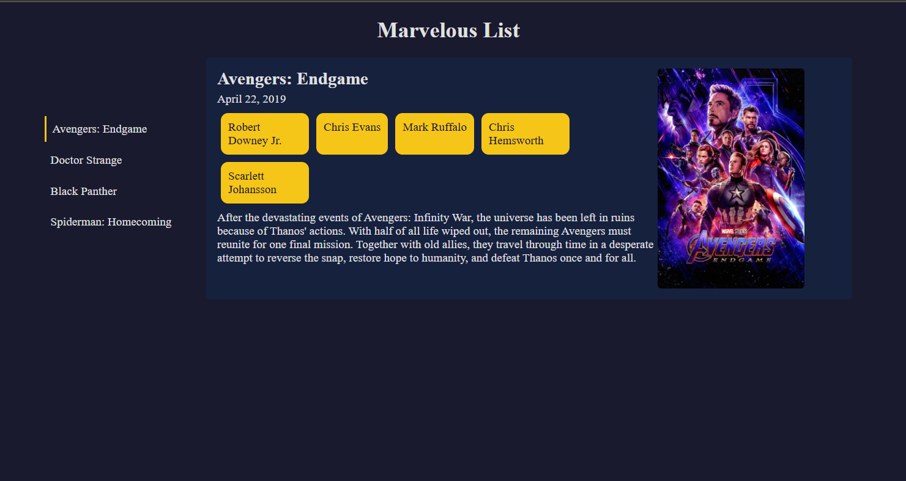

# 🎬 Marvelous List

A Marvel film browser built with vanilla HTML, CSS, and JavaScript. Click on a film title to see its details — poster, release date, cast, and description.

## Features

- Clickable film list that dynamically updates the details panel
- Displays title, release date, cast chips, description, and poster image
- Active state indicator on the selected film
- Clean cinematic dark theme

## Technologies Used

- HTML
- CSS (Flexbox, custom dark theme)
- JavaScript (DOM manipulation, object data structure, dynamic element creation with `createElement`/`appendChild`, `querySelectorAll` + `forEach`, `classList`, `dataset`)

## What I Learned

- How to store structured data using an object-of-objects and look up values by key
- Using `querySelectorAll` + `forEach` to add event listeners to multiple elements at once
- Reading `data-*` attributes with `e.target.dataset` to identify which element was clicked
- Dynamically creating and appending elements with `createElement` and `appendChild`
- Managing active states with `classList.add` and `classList.remove`
- Structuring a two-column layout with nested Flexbox

## Screenshot

